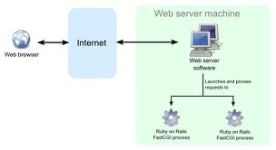
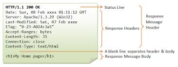

# HTTP Protocol
	Language of the Internet
* We will look at from a developers perspective. A solid understanding will allow you to understand and debug web applications. 

## Resources

* Are _Entities_ or _Objects_ that live on a server.

* We get , (html, json, xml, pdf,...), _Representations_ of these resources in the body of a HTTP Response sent back to the client from the server. 

* A resource may have all or a subset of CRUD operations.

For example, a Book may be resource that can be represented in html, json, pdf, mobi, etc. It may be created, read, updated and deleted. 

* A resource's representation will be determined by the [Media Type](http://en.wikipedia.org/wiki/Internet_media_type)  which is the value in the  [Accept](http://www.w3.org/Protocols/rfc2616/rfc2616-sec14.html)  HTTP Request Header and the [Content-Type](http://www.w3.org/Protocols/rfc2616/rfc2616-sec14.html) in the HTTP Response Header.

For example, to get the html representation of a Book resource the HTTP Request Accept header should be set to text/html by the client. 

If a server is returning the pdf representation, in the body of the HTTP Response, the Content-Type would be set to application/pdf.

* The location, or address, of the resource is specified by a URL.

## Network Stack  

#### Each layer represents a Protocol.
* These Protocols are defined by Request For Comment (RFC) documents. *No need to dig into these now*.
* We are going to focus on the HTTP protocol.

## Web Architecture

##### HTTP Clients
	* Browser. Chrome, Firefox, Safari, IE, …	
	* Command line utilities. curl, wget
	* HTTP Ruby libraries. HTTParty, Faraday, Typhoues, ...
##### HTTP Servers. *Web Servers*.
	* Apache, Nginx, Thin, Tomcat, Pow, WEBRick …
	
#### Web Frameworks. That run on the Server.
[Web Frameworks](http://en.wikipedia.org/wiki/Comparison_of_web_application_frameworks) typically sit behind a Web/HTTP Server. They can run on one or more Servers, behind one or more Web Servers, receive a HTTP Request and generate a HTTP Response.

	

* Ruby - Rack, Sinatra, Rails, Padrino, etc.
* PHP - Zend, Laravel, etc.
* Python - Django, ...
* Java - Grails, Spring, ...
	
## HTTP Request/Response

	

### HTTP Request  

	

	From a HTTP client,typically a browser, to a web server running on a host system. 
	* HTTP Request Methods
		GET and POST most used.
		* GET. Retrieve a resource.
		* POST. Create a resource.
		* PUT. Update a resource.
		* DELETE, Delete a resource.
		* HEAD, Retreive the headers for a resource. 
	* GET HTTP Request Format
		[method] [URL] [version]
		[headers]
	* Example GET Request:
		GET http://vermonster.com HTTP/1.1
		Accept:text/html,application/xhtml+xml,application/xml;q=0.9,image/webp,*/*;q=0.8
		Accept-Encoding:gzip,deflate,sdch
		Accept-Language:en-US,en;q=0.8
		Connection:keep-alive
		Host:vermonster.com
		User-Agent:Mozilla/5.0 (Macintosh; Intel Mac OS X 10_8_5)
		AppleWebKit/537.36 (KHTML, like Gecko) Chrome/32.0.1659.2 Safari/537.36#### 
		
		* Media Types
			What kind of resource can we retrieve? Defined by Multipurpose Internet Mail Extensions (MIME) standards. Used in the HTTP Request Accept Header and the HTTP Response Content-Type Header.
			* HTML = text/html
		  	* GIF Image = image/gif
		  	* PNG Image = image/gif
		  	* MP4 Video = video/mp4
		  	* PDF = application/pdf
		  	* JSON = application/json  
	* May have a body for creating or updating a resource. 
	  Submitting a HTML Form will send the Form contents in the body of the Request. 
	  
	  The body will be url encoded.
	  * The HTTP Request Accept header set to application/x-www-form-urlencoded 
	  *  name1=value1&name2=value2&...

  See [Media Types](http://en.wikipedia.org/wiki/Internet_media_type)*		
#### HTTP Response

	Reply to a HTTP client from a web server.
	* HTTP Response Overview
	[version] [status] [reason]
	[headers]
  
	[body]	# typically HTML, json, ...
	* HTTP version should be 1.1
	* Status Codes, [Status Codes](http://en.wikipedia.org/wiki/List_of_HTTP_status_codes)
		* 200  OK 
   		* 301 Moved Permanently 
		* 302 Moved Temporarily 
   		* 400 Bad Request   
		* 403 Forbidden 
		* 404 Not Found 
		* 500 Internal Server Error
### Viewing HTTP Request/Response
	* curl. Command line apps that sends requests.
		* curl -i http://www.vermonster.com/
	* Chrome Inspector. Developer tool built into Chrome browser.
		* View -> Developer -> Developer Tools 
		* Select Network
		* Cmd-R to send request

## Lab

Break up into groups of three. Do some research, _maybe using the HTTP book_, and answer all of the below questions:

1. What is a RFC and how does it apply to HTTP?
2. What are the HTTP methods and what/when are they used?
3. What are the HTTP status codes and how are they grouped?
4. What is the Accept HTTP Header used for? 
5. What are media types and which of these are used for HTML, JSON and plain text?
6. What is the Content-Type header?
7. Where do the HTTP status and Headers live? In the Request or Response?

## Demo
		
#### Resource Addresses, Uniform Resource Location (URL)
* \<scheme\>://\<host\>:\<port\>/\<path\>?\<query\>#\<fragment\>
	* HTML pages:
		* http://google.com
   		* https://news.ycombinator.com/
   		* http://github/tdyer
   		* https://help.github.com/articles/installing-git-html-help

	* Images:
		* http://imgs.xkcd.com/comics/online_communities.png

   * Video:
		* http://www.youtube.com/watch?v=BYB3Fx0a8-4	  

* URL Scheme. Part before the ://
	* http, https, ftp, ssh, ...
	* http, https handled by a web server.
	* ftp handled by a FTP server/daemon.
	* ssh handled by a SSH server/daemon.

*  Host. Name of the computer hosting the resource
   	* google.com, help.github.com, etc.
	* localhost is a special hostname that points to the computer your working on.
	* Translated to IP Address by DNS (Domain Name System)
		* &gt; nslookup  news.ycombinator.com
		* &gt; dig news.ycombinator.com

	* localhost is translated to 127.0.0.1 which is the IP address of your local computer.

* Port. A URL may have a port number.
	The port number will be after the host name but before the path.
	* Default ports are ports that will be used if a port is not included in a URL. 
		* Port 3111. http://railsinboston:3111/end_of_the_internet.
		* Port 80 is the default port for http.
		* Port 443 is the default port for https.
		* Port 3000 is the default port for rails applications running locally. http://localhost:3000

   There are many ports on each host system. Some of them are
   permanently assigned to protocols. 
	
	* List of assigned port numbers.
   		* http://en.wikipedia.org/wiki/List_of_TCP_and_UDP_port_numbers
   		* http://www.ietf.org/rfc/rfc1700.txt

* Path. Points to a resource on a host system. 
	* For the URL:
		* https://help.github.com/articles/installing-git-html-help
	* The Path is:
		* /articles/installing-git-html-help
		
	This typically indentifies an html page, executing code/script, image, etc
	behind a web server

* Query String. Used to send parameters to the web server/application.
	* Everything after the '?' is the query string
   	* Send the name-value pair 'q', 'brocolli' to the resource that lives at
	  www.bing.com and has the path 'search'
   		* http://www.bing.com/search?q=broccoli
	* The query string *may* have multiple parameters in the query string. Each parameter, name-value pair, is seperated by the ampersand character,'&'.

* URL Fragment. After the query string, seperated by the pound/hash
   '#' symbol. Only used by the browser to identify a section of a
   resource.
	* Fragment is 'feedback'
		* http://odetocode.com/Blogs/scott/archive/2011/11/29/programming-windows-8-the-sublime-to-the-strange.aspx#feedback 

* URL Encoding. Some characters are unsafe for URLs, space, pound '#', slash '/', ampersand '&', etc.
	* Need to use url encoded versions of these characters. 
	*  space is %20, ampersand is %26
	* [URL Encodings](http://http://www.w3schools.com/tags/ref_urlencode.asp)

#### Embedded Resources

Some resources, like an HTML page, may have embedded links (URLs).  

The browser will load these embedded resources after as it loads the containing page.  

For example, a HTML page may have links to images, videos, javascript, etc that will be *also* be loaded by the browser.

## Rack 

Rack provides a minimal interface between webservers supporting Ruby and Ruby frameworks.  

### Demo

See the [instructor_notes.md](instructor_notes.md)
